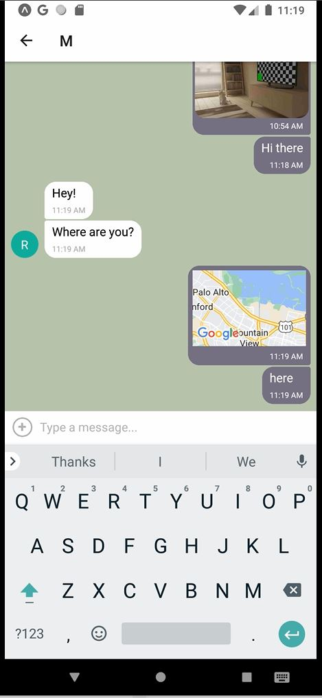

# Chat App

## Description
A messaging/chat app for mobile devices written in React Native. The app provides users with a chat interface and options to share images and location, and has offline capability so that conversations can be read back. Users can enter their name and choose a background color for the chat screen before joining the chat.

## Programs and systems
    * React Native: Framework for building mobile applications using JavaScript and React.
    * Expo and Expo Go: Development platform for building React Native applications.
    * Android Studio: Emulator to test the app
    * Firebase: database storage

## Setup
Needed: Terminal and Node, Expo and Expo CLI, as this is the platform you’ll use to build your app;

1. Before installing Expo, ensure you have a suitable version of Node installed.

2. Install Expo:

        npm install -g expo-cli

3. Expo Go App

    * Next, you’ll need the Expo Go app for your phone to run your project on. Search for the Expo Go app in the relevant app store for your device (iOS or Android), and install it.

4. Create an Expo account: 
    * https://expo.dev/
    * ExpoDocumentation: https://docs.expo.dev/more/expo-cli/

5. To log in to your Expo account for expo-cli in the terminal/Powershell, run expo login and go through the login process. 

6. Create a new Expo project 
    by entering:

        npx create-expo-app hello-world --template     
    
    For future projects, you’d change “hello-world” to the new name of your app.

    After the initialization is complete, go to your project’s directory using cd hello-world and start Expo with: 
    
        npx expo start

7. Google Firestore/Firebase
    * create an account and a new project
    * obtain the configuration code, and add it to App.js:
    * set up the database under build --> Firestore Database
    * activate storage
    * change rules to: allow read, write: if true

8. Testing Options
    * Expo App: download and connect the expo app on your mobile device
    * Android Studio (android)
    * Xcode (iOS)

## Dependencies:

    @expo/metro-runtime": "~3.2.1",
    "@react-native-async-storage/async-storage": "^1.23.1",
    "@react-native-community/netinfo": "11.3.1",
    "@react-navigation/native": "^6.1.17",
    "@react-navigation/native-stack": "^6.9.26",
    "dotenv": "^16.4.5",
    "expo": "~51.0.9",
    "expo-status-bar": "~1.12.1",
    "firebase": "^10.3.1",
    "react": "18.2.0",
    "react-dom": "18.2.0",
    "react-native": "0.74.1",
    "react-native-dotenv": "^3.4.11",
    "react-native-gifted-chat": "^2.4.0",
    "react-native-web": "~0.19.6",
    "react-native-maps": "1.14.0",
    "expo-image-picker": "~15.0.5",
    "expo-location": "~17.0.1"
